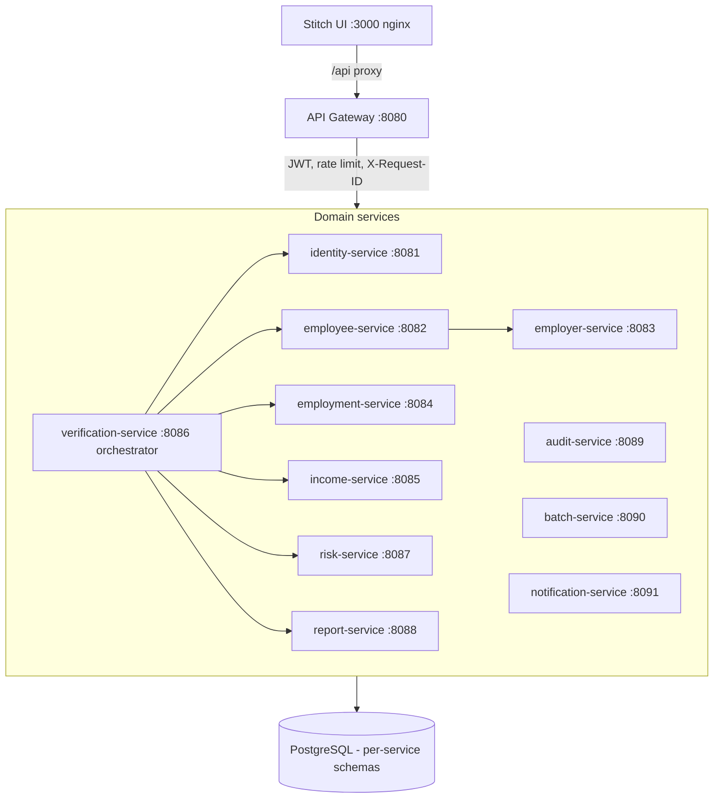

# ARCHITECTURE

## System overview (demo runtime)



## Principles

1. **Service boundaries follow data ownership.** Each service owns its schema and never
   reads another service's tables. Cross-service data flows through REST calls with
   timeouts and graceful degradation (see employer→employee profile call).
2. **Orchestration, not choreography, for the core flow.** The verification state machine
   is explicit and observable; each step is a persisted workflow event.
3. **Provider abstraction.** `IdentityVerificationProvider` (and the same pattern for
   employment/income/report) isolates the business layer from the demo data source, so a
   production provider can be swapped in without touching orchestration logic.
4. **Failure isolation over cascade.** Any single downstream failure degrades the result
   to `REVIEW_REQUIRED` rather than failing the request.
5. **Contracts over implementation.** Every service speaks the same success/error envelope,
   carries `X-Request-ID`, and logs structured lines.

## Verification state machine

```text
CREATED → PROCESSING → IDENTITY_CHECK → EMPLOYMENT_CHECK → INCOME_CHECK
        → RISK_CHECK → COMPLETED | REVIEW_REQUIRED | FAILED | EXPIRED
```

Transitions are recorded in `verification_workflow_events` with per-step status
(RUNNING/DONE/FAILED/SKIPPED), giving a complete audit of what ran, in what order,
with what outcome.

## Resilience design

| Concern | Demo implementation | Production evolution |
|---|---|---|
| Timeouts | 2s connect / 4–6s read per client | Circuit breakers (Resilience4j) |
| Partial failure | Step FAILED → final REVIEW_REQUIRED | Same + retry budget per step |
| Queue | Synchronous in-process | Kafka / Pub-Sub event backbone |
| Rate limiting | In-memory per-IP window (gateway) | Distributed limiter (Redis) |
| Health | Aggregated actuator checks | OpenTelemetry + SLO dashboards |

## Data flow: a verification request

```text
1. UI posts /api/v1/verifications (Idempotency-Key honored)
2. Gateway validates JWT, forwards X-Forwarded-User/Role + X-Request-ID
3. Orchestrator persists request (CREATED), then:
   identity.verify → employee index lookup (employee-service)
   employment.verify → employment records
   income.verify → income + pay periods
   risk.analyze → 10 rules + heuristics
   reports.generate → PDF bytes stored
4. Decision: VERIFIED / VERIFIED WITH REVIEW / NOT VERIFIED
5. Workflow events + audit records persisted at every transition
```

## Why these choices (interview summary)

- **Microservices** — verification, risk, reporting and audit have distinct scaling,
  security and compliance characteristics; independent deploys mirror real enterprise teams.
- **Spring Boot** — mature REST/JPA/security stack; constructor injection, validation and
  actuator health for free.
- **PostgreSQL per-service schemas** — transactional integrity for verification records;
  schema-per-service keeps boundaries honest on a free tier (one cluster).
- **Synchronous-first with async-ready seams** — the demo avoids Kafka for operability,
  while workflow events + provider interfaces make queueing a drop-in later.
