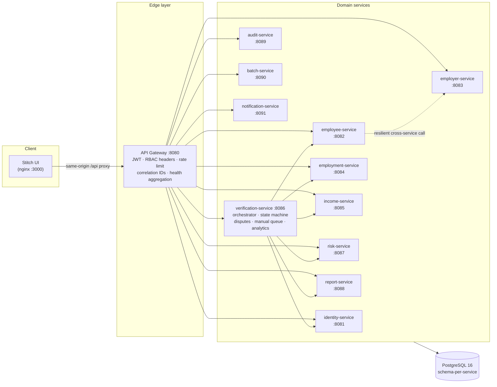

<div align="center">

# THE WORK CODE

### Employment · Income · Identity Verification Infrastructure

**A production-shaped, microservices-based workforce verification platform — built to enterprise fintech standards, powered entirely by synthetic data.**

[](https://openjdk.org)
[](https://spring.io/projects/spring-boot)
[](https://spring.io/projects/spring-cloud-gateway)
[](https://www.postgresql.org)
[](https://flywaydb.org)
[](https://www.docker.com)
[](#testing)
[](#-important-disclaimer)

**Synthetic demo data only · Not affiliated with Equifax or The Work Number**

</div>

---

## 📖 Table of Contents

- [What is this?](#-what-is-this)
- [Screens](#-screens)
- [60-second quick start](#-60-second-quick-start)
- [Demo credentials](#-demo-credentials)
- [The six interview scenarios](#-the-six-interview-scenarios)
- [Architecture](#-architecture)
- [The verification pipeline](#-the-verification-pipeline)
- [Feature matrix](#-feature-matrix)
- [API surface](#-api-surface)
- [Identity matching engine](#-identity-matching-engine)
- [Risk & fraud engine](#--risk--fraud-engine)
- [Synthetic data model](#-synthetic-data-model)
- [Security model](#-security-model)
- [Observability](#-observability)
- [Testing](#-testing)
- [Project structure](#-project-structure)
- [Configuration](#-configuration)
- [Deployment](#-deployment)
- [Performance notes](#-performance-notes)
- [Roadmap](#-roadmap)
- [Known limitations](#-known-limitations)
- [Contributing](#-contributing)
- [⚠ Important disclaimer](#-important-disclaimer)

---

## 🎯 What is this?

**The Work Code** is what an enterprise employment-verification platform looks like when
a lender underwrites a mortgage, an auto-finance desk approves a loan, or a property
manager screens a tenant — rebuilt from first principles as an original, open
implementation.

It answers four questions that every credit decision depends on:

| Question | Capability |
|---|---|
| *Does this person actually work there?* | **VOE** — Verification of Employment |
| *Can they afford it?* | **VOI** — Verification of Income (pay periods, gross/net, lookback windows) |
| *Are they who they claim to be?* | **Identity matching** — weighted, explainable scoring |
| *Is anything suspicious here?* | **Risk engine** — 10 fraud rules, severity-weighted scoring |

And it does so with the operational rigor real verification infrastructure demands:
idempotent request handling, per-step workflow observability, immutable audit trails,
RBAC, data masking, graceful degradation when a downstream service dies — and a PDF
report at the end of it.

### Why this exists

This is an **interview-grade portfolio project**. It demonstrates end-to-end command of:
distributed systems design, Spring Boot microservices, PostgreSQL schema-per-service
data modeling, API gateway security, deterministic scoring engines, batch pipelines,
PDF report generation, and enterprise UI integration — the full stack an architect
touches when building financial infrastructure.

Everything runs on free tiers. Nothing is faked behind a curtain — every workflow is
real code against real services.

---

## 🖼 Screens

All UI screens are generated with **Google Stitch** and preserved verbatim in
[`frontend/stitch-screens/`](frontend/stitch-screens) — the design system is documented
in [`verified_ledger/DESIGN.md`](frontend/stitch-screens/verified_ledger/DESIGN.md):
enterprise fintech, high-density data minimalism, tabular numerics, 1px keylines,
zero decorative noise.

| Screen | What it shows |
|---|---|
| **Operations Dashboard** | Live KPIs, verification volume, attention queue, risk alerts |
| **Verification Dossier** | Full workflow trace: identity → employment → income → risk → report |
| **Employees Directory** | 500 synthetic employees, server-side search/filter/pagination, data masking |
| **Income Verification** | Annualized income, pay-period tables, 12/24/36-month trends |
| **Risk & Fraud Analytics** | Anomaly feed with severity, explanations, recommended actions |
| **Audit Logs** | Immutable event trail with correlation IDs |
| **API Keys & Webhooks** | Developer surface with delivery logs and retry |
| **System Health** *(new)* | Aggregated microservice health from the gateway |
| **Interview Launcher** *(new)* | Six one-click scripted scenarios |
| **API Docs** *(new)* | Full developer portal |

---

## 🚀 60-second quick start

> Prereq: **Docker** (or Java 17+ + PostgreSQL if going bare-metal)

### Option A — full stack via Docker (recommended)

```bash
git clone https://github.com/Sparkydev007/The-Work-Code.git
cd The-Work-Code
docker compose up --build
```

That's it. You now have:

| Surface | URL |
|---|---|
| 🖥 **UI** (Stitch screens) | http://localhost:3000 |
| 🚪 **API Gateway** | http://localhost:8080 |
| ❤️ **Aggregate health** | http://localhost:8080/api/health |

### Option B — bare metal

```bash
# 1. PostgreSQL running locally (defaults expect db/user/pass = workcode)
# 2. Build + run everything
mvn clean package -DskipTests
./scripts/dev-up.sh          # boots 12 services + serves the UI on :3000
```

### First thing to try

```bash
# 1. Log in as the demo admin
TOKEN=$(curl -s -X POST http://localhost:8080/api/v1/auth/login \
  -H "Content-Type: application/json" \
  -d '{"username":"admin"}' | jq -r .data.token)

# 2. Run a full end-to-end verification
curl -s -X POST http://localhost:8080/api/v1/verifications \
  -H "Authorization: Bearer $TOKEN" \
  -H "Content-Type: application/json" \
  -H "Idempotency-Key: my-first-verification" \
  -d '{
    "verificationType": "EMPLOYMENT_AND_INCOME",
    "purpose": "MORTGAGE",
    "applicantName": "Rahul Sharma",
    "employeeNumber": "DEMO-PERFECT-001",
    "employerName": "Acme Technologies Pvt Ltd",
    "lookbackMonths": 24
  }' | jq
```

Watch it cascade through identity matching → employment verification → income
verification → risk analysis → report generation, and come back with a decision.

---

## 🔑 Demo credentials

Passwordless persona logins (demo only — see [Security](#-security-model)):

| Persona | Username | Role | Can do |
|---|---|---|---|
| **Admin** | `admin` | `ADMIN` | Everything |
| **Analyst** | `analyst` | `ANALYST` | Create verifications, review risk, resolve disputes |
| **Developer** | `developer` | `DEVELOPER` | API keys, webhooks, logs |
| **Viewer** | `viewer` | `VIEWER` | Read-only |

```bash
curl -X POST http://localhost:8080/api/v1/auth/login \
  -H "Content-Type: application/json" -d '{"username":"admin"}'
```

Roles are enforced **server-side** on every service via `RoleGuard` — the frontend
never decides what you're allowed to do.

---

## 🎬 The six interview scenarios

Open **`/stitch-screens/demo-interview/code.html`** and click through. Each scenario
drives the real orchestrator against the synthetic dataset:

| # | Scenario | Subject | Expected outcome |
|---|---|---|---|
| 1 | **Perfect verification** | `DEMO-PERFECT-001` — Rahul Sharma @ Acme Technologies | `MATCH` → `VERIFIED` → risk 14 (LOW) → PDF report |
| 2 | **Identity mismatch** | Name doesn't match the record | `NO_MATCH` (review zone) → `VERIFIED WITH REVIEW` |
| 3 | **No hit** | `EMP-999999` — person doesn't exist | `NO_HIT` → graceful NOT VERIFIED |
| 4 | **Income anomaly** | `DEMO-INCOME-001` — 62% payroll variance | Income `REVIEW` → risk MEDIUM |
| 5 | **Duplicate identity** | `DEMO-FRAUD-001` — duplicate + velocity + pattern | Risk HIGH/CRITICAL + persisted anomalies |
| 6 | **Manual fallback** | `DEMO-MANUAL-001` — low-coverage employer | Routed to manual queue → simulated employer contact |

Failure injection is built in — add `?simulate=IDENTITY` (or `EMPLOYMENT`, `INCOME`)
to any verification request and watch the orchestrator degrade gracefully instead of
crashing:

```bash
curl -X POST "http://localhost:8080/api/v1/verifications?simulate=INCOME" ...
# → workflow shows INCOME_LOOKUP: FAILED → final status: REVIEW_REQUIRED
```

---

## 🏗 Architecture



### Design principles

<details>
<summary><b>1. Service boundaries follow data ownership</b></summary>

Each of the 11 services owns its PostgreSQL schema and never reads another service's
tables. Cross-service data flows through REST with hard timeouts. When employee-service
is unreachable, employer-service still serves profiles — the employee count just reports
`UNAVAILABLE` (real graceful degradation, not a slide).
</details>

<details>
<summary><b>2. Orchestration with an explicit state machine</b></summary>

The verification lifecycle is a persisted, observable state machine:

```
CREATED → PROCESSING → IDENTITY_CHECK → EMPLOYMENT_CHECK → INCOME_CHECK
        → RISK_CHECK → COMPLETED | REVIEW_REQUIRED | FAILED | EXPIRED
```

Every step writes a `verification_workflow_events` row — the dossier screen renders
exactly what ran, in order, with what outcome. Debugging a verification means reading
its event log, not guessing.
</details>

<details>
<summary><b>3. Provider abstraction for future data sources</b></summary>

```java
public interface IdentityVerificationProvider {
    IdentityVerifyResponse verify(IdentityVerifyRequest request);
}
```

`DemoIdentityProvider` resolves against the synthetic index. A production provider —
a real workforce-data network — implements the same interface and the entire
orchestration, reporting and risk stack works unchanged.
</details>

<details>
<summary><b>4. Failure isolation over cascade</b></summary>

Any single downstream failure degrades the final result to `REVIEW_REQUIRED` rather
than failing the request. Employment can verify even when income is down. The audit
trail records which step failed and why.
</details>

<details>
<summary><b>5. Enterprise API contract everywhere</b></summary>

Every service speaks the same envelope, carries `X-Request-ID` end-to-end, and maps
exceptions to canonical error codes with recommended actions:

```json
{
  "success": false,
  "error": {
    "code": "EMPLOYEE_NOT_FOUND",
    "message": "Employee 'EMP-999' was not found.",
    "recommendedAction": "Verify the identifier and retry, or search the directory."
  },
  "requestId": "REQ-a1b2c3"
}
```
</details>

---

## ⚙️ The verification pipeline

```text
 POST /api/v1/verifications          (Idempotency-Key honored — replays return the original)
        │
        ▼
 ┌────────────────────────────────────────────────────────────────┐
 │ 1. IDENTITY_MATCHING    → identity-service                     │
 │    weighted scoring vs synthetic index                        │
 │    MATCH / NO_MATCH / NO_HIT + attribute scores               │
 ├────────────────────────────────────────────────────────────────┤
 │ 2. EMPLOYMENT_LOOKUP    → employment-service                  │
 │    VERIFIED / REVIEW / NOT_VERIFIED / NO_RECORD               │
 │    + tenure history timeline                                  │
 ├────────────────────────────────────────────────────────────────┤
 │ 3. INCOME_LOOKUP        → income-service                      │
 │    (income & combined types only)                             │
 │    annualized income · pay periods · 12/24/36-mo lookback     │
 ├────────────────────────────────────────────────────────────────┤
 │ 4. RISK_ANALYSIS        → risk-service                        │
 │    10 rules · 5 dimensions · 0-100 score · LOW→CRITICAL       │
 │    HIGH+ signals persisted as anomalies                       │
 ├────────────────────────────────────────────────────────────────┤
 │ 5. REPORT_GENERATION    → report-service                      │
 │    branded PDF with disclaimers, stored for download          │
 └────────────────────────────────────────────────────────────────┘
        │
        ▼
 DECISION: VERIFIED │ VERIFIED WITH REVIEW │ NOT VERIFIED
 + workflow events + audit records + PDF + webhook events
```

---

## 📊 Feature matrix

| | Feature | Status | | Feature | Status |
|---|---|---|---|---|---|
| ✅ | Employment Verification (VOE) | **DONE** | ✅ | Batch CSV Processing | **DONE** |
| ✅ | Income Verification (VOI) | **DONE** | ✅ | PDF Reports (OpenPDF) | **DONE** |
| ✅ | Identity Match Engine | **DONE** | ✅ | Dispute Center | **DONE** |
| ✅ | MATCH / NO_MATCH / NO_HIT | **DONE** | ✅ | Employee Self-Service Data | **DONE** |
| ✅ | Historical Employment Timeline | **DONE** | ✅ | Immutable Audit Logs | **DONE** |
| ✅ | 12/24/36-Month Lookback | **DONE** | ✅ | RBAC (4 roles) | **DONE** |
| ✅ | Pay-Period Level Data | **DONE** | ✅ | API Gateway + JWT | **DONE** |
| ✅ | Risk Engine (10 rules) | **DONE** | ✅ | Webhooks + Delivery Logs | **DONE** |
| ✅ | Fraud/Anomaly Detection | **DONE** | ✅ | Manual Verification Fallback | **DONE** |
| ✅ | Analytics Dashboard | **DONE** | ✅ | Data Masking | **DONE** |
| ✅ | Global Search | **DONE** | ✅ | System Health Dashboard | **DONE** |
| ✅ | Docker Compose Stack | **DONE** | ✅ | Interview Demo Mode | **DONE** |
| 🔜 | API Key Management UI | roadmap | 🔜 | Playwright E2E | roadmap |
| 🔜 | Kafka-backed async orchestration | roadmap | 🔜 | OpenAPI/Swagger UI | roadmap |

---

## 🔌 API surface

33+ endpoints across 11 services, all behind the gateway. Full reference in
[`API.md`](API.md). The highlights:

### Core verification
```http
POST   /api/v1/verifications                      # create + process (idempotent)
GET    /api/v1/verifications/{id}                 # full dossier + workflow trace
GET    /api/v1/verifications?status=&type=&search=
POST   /api/v1/verifications/{id}/rerun
POST   /api/v1/verifications?simulate=IDENTITY    # failure injection for demos
```

### Identity matching
```http
POST   /api/v1/identity/verify
# → { "result": "MATCH", "confidence": 98.6,
#     "nameScore": 1.0, "employerScore": 1.0, "employeeIdScore": 1.0, "emailScore": 0.95 }
```

### Data services
```http
GET    /api/v1/employees?search=rahul&masked=true # directory with masking
GET    /api/v1/employment/employees/{id}/history  # tenure timeline
GET    /api/v1/income/employees/{id}/pay-periods  # payroll table
GET    /api/v1/income/employees/{id}/trend        # 12/24/36-mo chart data
```

### Risk, reports, batch, ops
```http
POST   /api/v1/risk/analyze                       # score + band + signal explanations
GET    /api/v1/reports/{code}/download            # PDF download
POST   /api/v1/batches                            # multipart CSV upload
GET    /api/v1/audit?action=DOWNLOAD_REPORT       # immutable audit trail
POST   /api/v1/webhooks/{id}/test                 # simulated delivery + log
GET    /api/v1/analytics/dashboard                # KPIs + distributions
GET    /api/health                                # aggregated service health
```

---

## 🧮 Identity matching engine

A **transparent, deterministic, original** algorithm — documented, explainable, and
unit-tested. *Not derived from any commercial provider's proprietary scoring.*

### Attribute weights

| Attribute | Weight | Method |
|---|---|---|
| Name similarity | **40%** | Character-bigram Dice ∪ token Jaccard ∪ edit-distance blend |
| Employer match | **25%** | Same blended similarity on employer names |
| Employee ID | **25%** | Exact match after normalization (binary) |
| Email / domain | **10%** | Exact → 1.0 · same domain → 0.7 · else 0.0 |

Missing attributes score a neutral **0.5** — absent data neither helps nor destroys.

### Decision thresholds

```text
score ≥ 90          → MATCH
score 60–89         → NO_MATCH (review zone — routes to manual review)
score < 60          → NO_MATCH
no candidate found  → NO_HIT
```

### Example breakdown (demo payload)

```text
Name Match        97.2%   ("Rahul Sharman" vs "Rahul Sharma")
Employer Match   100.0%
Employee ID      100.0%
Email Match       95.0%
─────────────────────────
Overall          98.6%   → MATCH
```

Every response carries the full breakdown, so an underwriter (or an interviewer) can
see *why* a decision was made.

---

## 🛡 Risk & fraud engine

Ten deterministic rules across five weighted dimensions, producing a 0–100 score with
human-readable explanations and recommended actions.

### Dimensions & weights

```text
Identity risk    30%    Employment risk   25%    Income risk    20%
Request risk     15%    Duplicate risk    10%
```

### The rules

| # | Rule | Severity |
|---|---|---|
| 1 | High verification velocity (many orgs, short window) | 4/5 |
| 2 | Same employee ID associated with multiple people | 5/5 |
| 3 | Same email across multiple employee records | 3/5 |
| 4 | Employer mismatch vs record on file | 4/5 |
| 5 | Income variance > 45% threshold | 4/5 |
| 6 | Overlapping full-time tenures | 4/5 |
| 7 | Repeated failed identity attempts (escalating) | 3–5/5 |
| 8 | Suspicious request pattern (burst + rotation) | 4/5 |
| 9 | Employer flagged in trust register | 3/5 |
| 10 | Impossible payroll pattern (dates/deductions) | 5/5 |

### Bands

```text
  0–29  LOW        ✅ auto-decision
 30–59  MEDIUM     ⚠ flagged, continues
 60–79  HIGH       🚨 routes to manual review + anomaly created
80–100  CRITICAL   🚨 routes to manual review + anomaly created
```

Each negative signal persists as a **risk anomaly** with severity, explanation,
related verification, and recommended action — feeding the Risk & Fraud Analytics
screen.

---

## 🗃 Synthetic data model

Deterministic (seeded) generation — **the same dataset on every machine, every run**:

| Entity | Count | Consistency guarantees |
|---|---|---|
| Employers | 20 | Fictional Indian + international companies, trust statuses |
| Employees | 500 | Unique IDs, 5 fixed scenario subjects, realistic name/email/phone |
| Employment records | ~1,100 | 1–4 non-overlapping tenures per employee, aligned hire/termination dates |
| Pay periods | thousands | Aligned to pay frequency (weekly/biweekly/semimonthly/monthly), gross = base + OT + bonus + commission, net = gross − deductions |
| Verification requests | on demand | Full workflow event history |
| Risk anomalies | 5+ seeded | Severity, explanation, recommended action |
| Audit events | 50 seeded | Actors, actions, correlation IDs |

**Data integrity rules (enforced by generator, locked by unit tests):**
- Termination date ≥ hire date, always
- Historical tenures never overlap
- Annualized income ≡ monthly × 12 (plus documented bonus/OT variance)
- Pay periods exist only within employment windows
- Scenario subjects are deterministic: `DEMO-PERFECT-001`, `DEMO-MISMATCH-001`,
  `DEMO-INCOME-001`, `DEMO-FRAUD-001`, `DEMO-MANUAL-001`

All names, employers, emails and phone numbers are **fictional**.

---

## 🔐 Security model

Production-shaped seams with honest demo boundaries. Full detail in [`SECURITY.md`](SECURITY.md).

### Implemented

| Control | Implementation |
|---|---|
| **Authentication** | JWT (HS256) issued at gateway, validated on every protected request; tamper/expiry/garbage rejected (unit-tested) |
| **Authorization** | RBAC enforced **server-side** via `RoleGuard` on every service; gateway forwards identity headers; frontend role state never trusted |
| **Data masking** | Default-on for list views: DOB & income redacted, emails (`r••••@…`) and phones (`•••••4821`) partially masked |
| **Correlation IDs** | `X-Request-ID` generated/propagated at gateway, echoed on every response, logged in every service |
| **Input validation** | Bean Validation on all bodies → 400 with field-level errors |
| **Rate limiting** | Per-IP sliding window at the gateway → 429 `RATE_LIMITED` |
| **Audit** | Append-only log: login, create/view/rerun verification, download report, key lifecycle, disputes, exports |
| **Secrets** | Nothing in the repo; `.env.example` documents every variable; containers run non-root |
| **CORS** | Explicit dev origin allowlist; never `*` on credentialed routes |

### Honest demo boundaries

- Personas are passwordless (no credential store) — production needs BCrypt/Argon2 +
  refresh tokens + revocation.
- Webhook delivery is **simulated** (deterministic outcomes, logged, retryable) — not
  real HTTP egress.
- API-key service is designed (hash+prefix contract) but the UI is roadmap.

---

## 📡 Observability

| Signal | Where |
|---|---|
| Aggregate health | `GET /api/health` → per-service UP/DEGRADED/DOWN + latency |
| Per-service health | `/actuator/health` on every service |
| Request tracing | `X-Request-ID` in logs + response headers, end to end |
| Workflow tracing | `verification_workflow_events` — every step, status, timing |
| Structured logs | `http method=… path=… status=… durationMs=…` on every request |
| Audit trail | `audit_events` — who did what to which resource, when |
| UI dashboard | `system_health` screen (live polling) |

---

## 🧪 Testing

**25 unit tests, all passing** — covering the two engines where correctness matters most:

```bash
mvn clean verify
```

| Suite | Tests | Locks down |
|---|---|---|
| `DemoDataFactoryTest` | 9 | Deterministic seeds · unique IDs · scenario subjects · hire/termination integrity · non-overlapping tenures · payroll math · annualization |
| `JwtSupportTest` | 5 | Round-trip · tamper rejection · garbage rejection · cross-secret rejection · RBAC capabilities |
| `IdentityMatchingEngineTest` | 8 | MATCH ≥90 · typo tolerance · wrong-name/ID → NO_MATCH · unknown → NO_HIT · neutral scoring · determinism · normalization |
| `RiskEngineTest` | 7 | Clean file → LOW · duplicate/velocity → HIGH+ · income anomaly · employer mismatch → MEDIUM · escalation · band mapping · saturation at 100 · determinism |

**Design note:** both scoring engines are pure static functions over context maps —
no Spring context needed, trivially testable, impossible to flake.

### Roadmap suites

- Testcontainers integration tests (Flyway + seed + repository + orchestrator happy path)
- Contract tests asserting the envelope shape on every controller
- Playwright E2E: login → dashboard → verify → report → dispute → search
- Failure-injection tests via `?simulate=`

---

## 📁 Project structure

```text
the-work-code/
├── frontend/                      # Google Stitch UI (preserved verbatim)
│   ├── stitch-screens/            #   20 original screens + design system
│   │   ├── demo-interview/        #   ★ new: interview scenario launcher
│   │   ├── api_docs/              #   ★ new: developer portal
│   │   └── system_health/         #   ★ new: live service health
│   ├── assets/js/
│   │   ├── twc-api.js             # central API client (auth, envelope, masking, fallback)
│   │   └── twc-demo-launcher.js   # scenario runner with animated workflow
│   ├── nginx.conf                 # same-origin /api proxy
│   └── index.html
│
├── services/
│   ├── api-gateway/               # Spring Cloud Gateway: routes, JWT, rate limit, health
│   ├── identity-service/          # matching engine + verification store
│   ├── employee-service/          # directory + search + masking + seeding
│   ├── employer-service/          # employer network + resilient profile
│   ├── employment-service/        # VOE + tenure history
│   ├── income-service/            # VOI + pay periods + lookback + trends
│   ├── verification-service/      # orchestrator + disputes + manual queue + analytics
│   ├── risk-service/              # 10-rule engine + anomaly store
│   ├── report-service/            # OpenPDF generation + download
│   ├── batch-service/             # CSV validate/process/export
│   ├── audit-service/             # append-only audit
│   └── notification-service/      # webhooks + notifications (simulated delivery)
│
├── shared/common-lib/             # API envelope · error codes · JWT · correlation · data factory
├── scripts/                       # dev-up.sh · launch-all.sh
├── docs/                          # diagrams & screenshots
├── docker-compose.yml             # full stack (Postgres + 12 services + UI)
├── Dockerfile.service             # shared multi-stage build
└── *.md                           # ARCHITECTURE · API · DATABASE · SECURITY · DEPLOYMENT
                                  # TESTING · INTERVIEW_GUIDE · STITCH_INTEGRATION
                                  # PROJECT_PROGRESS
```

---

## ⚙️ Configuration

Every variable has a working default for local demo. See [`.env.example`](.env.example).

| Variable | Default | Purpose |
|---|---|---|
| `SPRING_DATASOURCE_URL` | `jdbc:postgresql://localhost:5434/workcode` | Postgres (Neon/Supabase compatible) |
| `SPRING_DATASOURCE_USERNAME` / `_PASSWORD` | `workcode` / `workcode` | DB credentials |
| `JWT_SECRET` | demo value | **Change for any shared deployment** (32+ chars) |
| `DEMO_MODE` | `true` | Enables demo surfaces |
| `SEED_DEMO_DATA` | `true` | Auto-seed synthetic dataset on empty tables |
| `GATEWAY_*_TARGET` | localhost ports | Service discovery (compose sets these) |
| `TWC_API_BASE` | `http://localhost:8080` | Frontend → gateway base URL |
| `TWC_USE_DEMO_DATA` | `true` | Frontend graceful fallback when backend is down |

---

## ☁ Deployment

Free-tier friendly. Full walkthrough in [`DEPLOYMENT.md`](DEPLOYMENT.md).

| Layer | Option |
|---|---|
| **Database** | Neon / Supabase PostgreSQL (free) — just override the datasource env vars |
| **Backend** | Render / Fly.io / Railway containers — or one VM running `docker compose up -d` (honest *single-host microservice demo deployment*) |
| **Frontend** | Vercel / Netlify / any static host for `frontend/` + API proxy |
| **CI** | GitHub Actions-ready: `mvn verify` gate on every push |

Post-deploy smoke test:

```bash
curl https://your-gateway/api/health
curl -X POST https://your-gateway/api/v1/auth/login -d '{"username":"admin"}' -H "Content-Type: application/json"
```

---

## 📈 Performance notes

- **Server-side pagination everywhere** — no screen loads 5,000 rows; defaults 25/page, hard-capped 200.
- **Indexed lookups** — employee_number, employer_code, status, pay_date, verification_id, created_at all indexed per schema.
- **Connection pools** — HikariCP capped (6/service) for free-tier Postgres limits.
- **Timeouts** — every inter-service call: 2s connect / 4–6s read. Nothing hangs forever.
- **Batch pipeline** — chunked `saveAll` (1,000 rows/batch) during seeding; 5,000-row demo batch cap.
- **Stateless engines** — identity & risk are pure functions: horizontally scalable by construction.

---

## 🗺 Roadmap

| Quarter | Item |
|---|---|
| Next | API-key management service + UI (contract already specced) |
| Next | Playwright E2E + Testcontainers integration suite |
| Next | OpenAPI 3.1 generation + Swagger UI at `/swagger-ui` |
| Then | Kafka/Pub-Sub event backbone behind the orchestrator's existing event log |
| Then | Employee self-service portal (disputes + report download for subjects) |
| Exploring | gRPC between orchestrator and engines · OpenTelemetry traces |

---

## ⚠ Known limitations

Honest list — what this project does **not** do:

1. **No real verification network.** All providers are demo implementations over synthetic data. No external workforce-data connectivity exists or is implied.
2. **Simulated webhook egress.** Deliveries are deterministic simulations with logs and retries — no real HTTP calls leave the system.
3. **Synchronous orchestration.** The pipeline is in-process HTTP; the event log and provider interfaces make queueing a drop-in upgrade, but today it's sync.
4. **Demo authentication.** Passwordless personas; no credential store, refresh flow, or revocation list.
5. **Single-cluster database.** Schema-per-service boundaries are real, but all schemas share one Postgres instance.
6. **Analytics type-distribution is simplified** (placeholder counts) — the dashboard metrics are real aggregations.

---

## 🤝 Contributing

This is a portfolio project, but improvements are welcome:

```bash
git clone https://github.com/Sparkydev007/The-Work-Code.git
cd The-Work-Code
mvn clean verify              # must pass before any PR
docker compose up --build     # must boot clean
```

Standards enforced in this codebase:
- Constructor injection only — no field `@Autowired`
- DTO boundaries at every service edge — entities never leak
- `RoleGuard.require(...)` on every protected endpoint
- Flyway for all schema changes — no `ddl-auto: update` ever
- Every engine rule gets a unit test with its expected band/score

---

## 📄 Important disclaimer

> **This project uses synthetic demonstration data only and does not connect to Equifax,
> The Work Number, or any commercial verification network.**
>
> The Work Code is an original portfolio implementation inspired by the *publicly
> documented capabilities* of enterprise workforce-verification ecosystems. It contains
> **no** proprietary code, algorithms, databases, trademarks, logos, screenshots, or UI
> assets from any commercial provider. All people, employers, payroll records, and
> verification events are fictional.
>
> Identity-matching and risk-scoring algorithms are original, transparent
> implementations documented in this README — they are **not** represented as equivalent
> to any commercial provider's proprietary systems.
>
> This software is for educational and portfolio purposes. It is **not** certified,
> compliant, or intended for real underwriting, FCRA-regulated use, or any production
> decisioning.

---

<div align="center">

**Built as a demonstration of enterprise-grade engineering on a zero-dollar stack.**

*Java · Spring Boot · Microservices · PostgreSQL · Spring Cloud Gateway · JWT/RBAC · OpenPDF · Docker*

</div>
